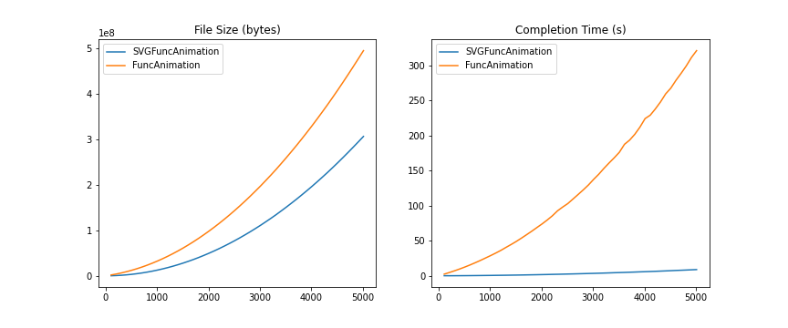

# SVGFuncAnimation

### How it works:

This aims to be a drop-in replacement for matplotlib's `FuncAnimation` which works only for SVG based animations. As such,
it's interface is greatly simplified, and it comes with its own, built-in, `HTMLWriter`-like writer. 

Because it focuses solely on SVGs, the resulting html animation displays the SVG document directly instead of a 
base64-encoded version. This allows direct manipulation of the SVG DOM which is fast and memory efficient as the whole 
frame is not needed.

This works by redrawing only individual artists instead of the whole frame. The artist redraw creates a new SVG tag 
(which can be captured with some StringIO manipulations). This new tag is then dynamically inserted into the SVG document
by the accompanying JS script when that frame is reached. 

In order to fetch the correct tag that needs to be updated, we rename every artist's GID to that artist's hash. 
This new ID the allows us to find the correct SVG tag and keep track of all artists. 

### Demo:

SVGFuncAnimation is much faster and more memory efficient than it's FuncAnimation counter:

Please see [svgfuncanim](svgfuncanim.ipynb) for a quick demo, and [this](svgfuncanim_benchmark.ipynb) to see 
how the above was generated.

### Current Limitations:

This is still a WIP, so these are subject to change, but currently, one of the main limitations of `SVGFuncAnimation` is 
that it requires that all artists that will be drawn during the animation be present from the onset. That is, the creation 
of new artists within the user-provided update function is not yet supported.

Some artists, like `Text` artists might also be blank/empty and thus not be drawn when the animation initializes. For now, 
a good workaround is to make sure they are initialized with non-emtpy text (such as a space).

# HTMLDiffWriter

An experimental `HTMLWriter` for matplotlib animations that stores only the first frame as well as the frame 
deltas/diffs of consecutive frames. Frames are therefore computed on the fly which should enable huge memory savings 
but might be slow. 

This was originally intended for use only with animations that use the SVG frame format, but because diffing is done 
on the base64-encoded frames, this also applies to other formats (although the filesize might not reduce as much).

See [diffwriter](diffwriter.ipynb) for a quick demo.

---

See [this matplotlib issue](https://github.com/matplotlib/matplotlib/issues/19694) for more.
